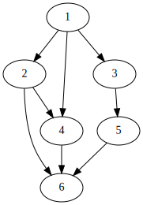

# Resch 🥨

Static Scheduling Algorithms for FPGAs

Resch is part of my research to evaluate exact and heuristic algorithms for the scheduling of tasks on FPGAs.

It provides an abstraction for machine models, schedules and task graphs. Under the hood, it uses graph-tool to import
graphs and OR-Tools to generate optimal schedules.

Currently implemented heuristics are:

- [HEFT](resch/heft/original.py), which is a baseline for scheduling on heterogeneous resources but not specifically designed for
- [CPOP](resch/heft/cpop.py), an algorithm that tries to minimize the CP, also not designed for FPGAs.

## Example

A simple example of its usage is shown in [the examples](examples/heft.py):

```python
g = import_graph(...)
w = import_weights(...)
c = import_edge_weights(...)
S = heft.build_schedule(g, w, c)
S.save_svg("heft.svg", machine_model, print_locs = False)
```

This converts the graph `g`:



to a schedule like this:


For feedback or questions, please contact me at [pascal.jungblut@nm.ifi.lmu.de](mailto:pascal.jungblut@nm.ifi.lmu.de).
